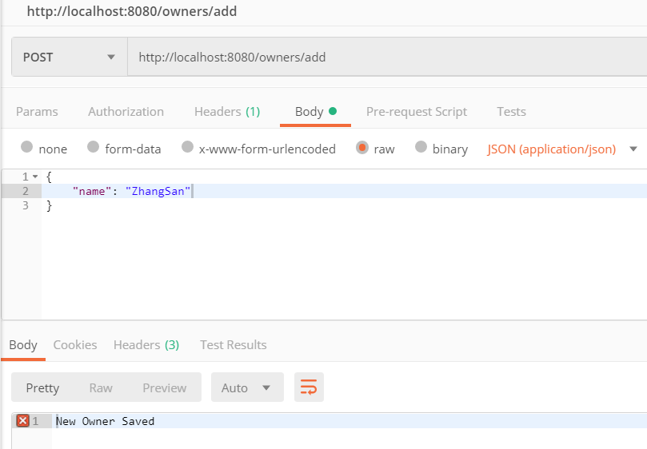
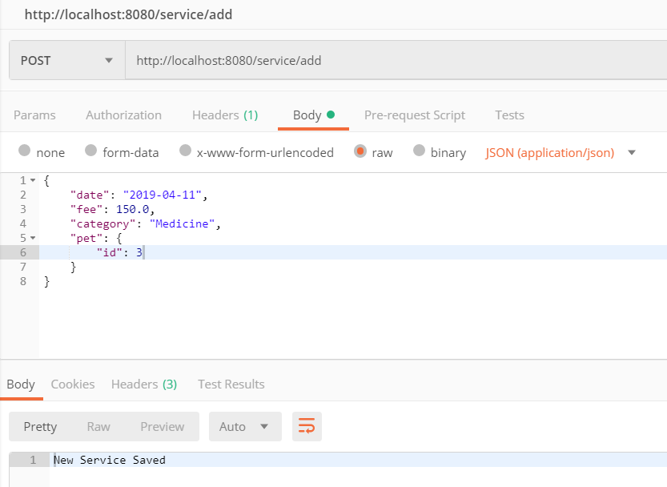
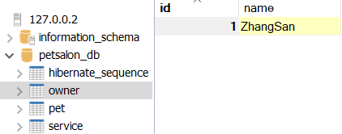
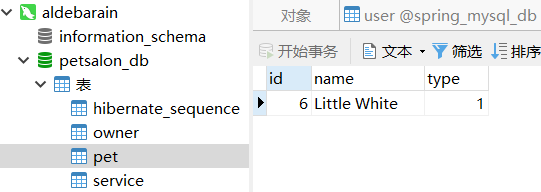

# Petsalon v1.3

1. Post：http://localhost:8080/owners

   

   

2. Post：http://localhost:8080/pets

   

   

   

3. Post：http://localhost:8080/service

   

   

   

4. Get：http://localhost:8080/service

   

   

5. Get：http://localhost:8080/pets

   

   

   

6. Get：http://localhost:8080/owners

   

   

   

# Petsalon v1.2

1. Post：http://localhost:8080/owners/add

   

   

2. Post：http://localhost:8080/pets/add

   

   

3. Post：http://localhost:8080/pets/add

   

   

4. Get：http://localhost:8080/owners/all

   

   

5. Post：http://localhost:8080/service/add

   

   

6. Post：http://localhost:8080/service/add

   

   

7. Post：http://localhost:8080/service/add

   

   

8. Get：http://localhost:8080/service/all

   

   

9. Get：http://localhost:8080/pets/all

   

   

10. Get：http://localhost:8080/owners/all

    

    

11. DataBase：Owner

    

    

12. DataBase：Pet

    

    

13. DataBase：Service

    

    

# Petsalon v1.0

以 <http://localhost:8080/pets/> 为例：

- Get：<http://localhost:8080/pets/all> 

  

  可见，当前数据库为空，可查看数据库：

  

  

- Post：http://localhost:8080/pets/add

  

  成功传上了一个名为“Little White”的猫，查看数据库：

  

  刷新网页 <http://localhost:8080/pets/all>，可以看到：

  

  

- 终止程序，再次查看数据库，数据没有消失，持久化存储成功

