# Petsalon v1.2

- 添加 Owner - Pet 的一对多关联（双向）
- 添加 Pet - Service 的一对多关联（双向）

以上两个关联，添加时需要注意：

1. 在 @OneToMany 之下使用 @JoinColumn(name="...") 来指定生成外键的名字，而不能使用 @OneToMany(mappedBy="...")，否则会产生中间表，据我个人猜测，这导致同时具有 @OneToMany 和 @ManyToOne 的类 Pet 的 Table 内部产生分歧（两个中间表），导致无法 Post
2. 在 @ManyToOne 之上使用 @JsonBackReference，避免双向关联导致的输出 Json 文件产生死循环


### 关联代码

- Owner (1*Owner >>> n * Pet)

  ```java
  @Entity
  public class Owner {
      ...
      @OneToMany(targetEntity=Pet.class, cascade=CascadeType.ALL)
  	@JoinColumn(name="owner", referencedColumnName = "id")
      private Set<Pet> petSet; // 宠物集合
      ...
      ... // getter-setter for petSet
  }
  ```

  

- Pet (1*Pet >>> n * Service)

  ```java
  @Entity
  public class Pet {
      ...    
  	@JsonBackReference // 防止双向关联死循环
  	@ManyToOne(targetEntity=Owner.class)
      @JoinColumn(name="owner", referencedColumnName = "id")
      private Owner owner; // 对应主人
  
      @OneToMany(targetEntity=Service.class, cascade=CascadeType.ALL)
  	@JoinColumn(name="pet", referencedColumnName = "id")
      private List<Service> serviceList; // 服务列表
      ...
      ... // getter-setter for serviceList & owner
  }
  ```

  

- Service

  ```java
  @Entity
  public class Service {
      ...
  	@JsonBackReference // 防止双向关联死循环
  	@ManyToOne(targetEntity=Pet.class)
      @JoinColumn(name="pet", referencedColumnName = "id")
      private Pet pet; // 对应宠物
      ...
      ... // getter-setter for pet
  }
  ```

  

### 运行（Postman）

1. Post：http://localhost:8080/owners/add

   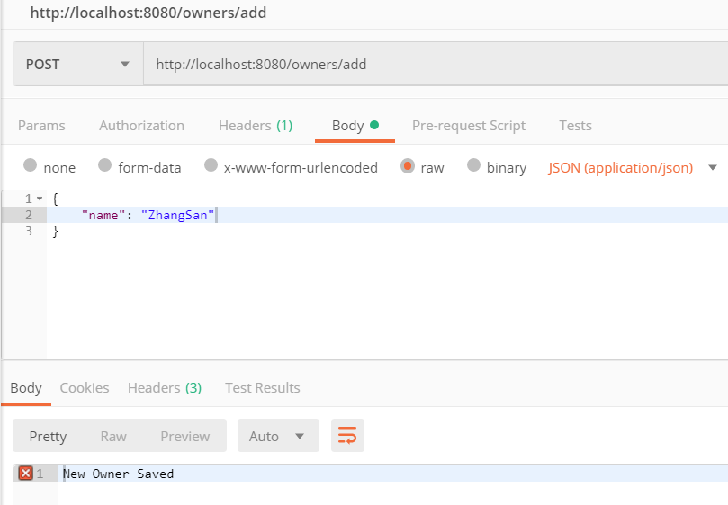

   

2. Post：http://localhost:8080/pets/add

   

   

3. Post：http://localhost:8080/pets/add

   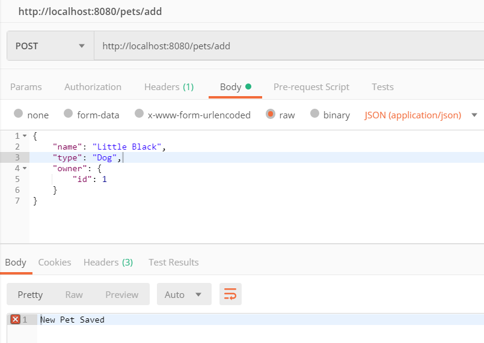

   

4. Get：http://localhost:8080/owners/all

   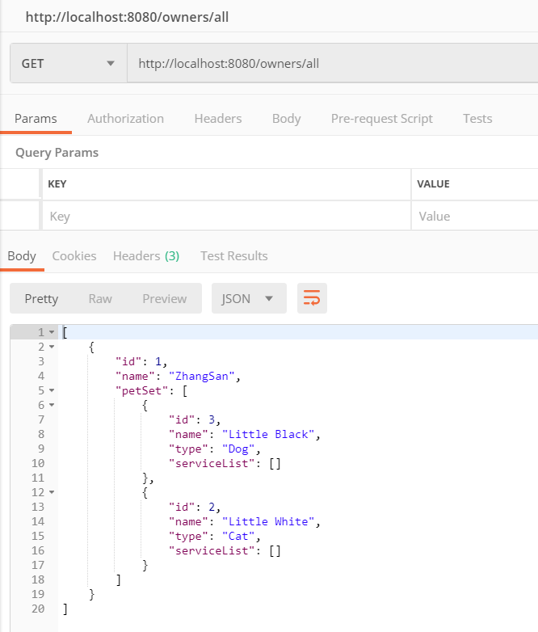

   

5. Post：http://localhost:8080/service/add

   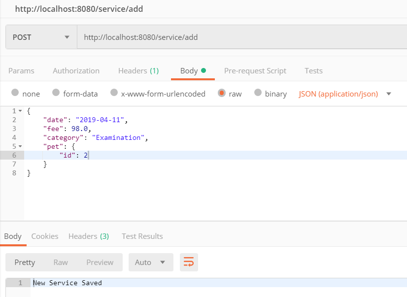

   

6. Post：http://localhost:8080/service/add

   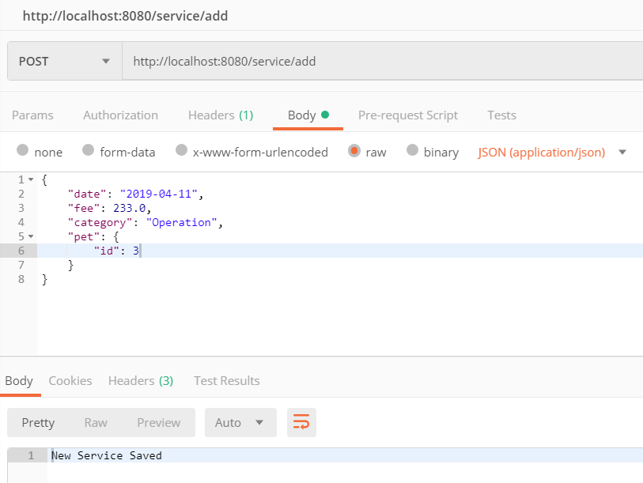

   

7. Post：http://localhost:8080/service/add

   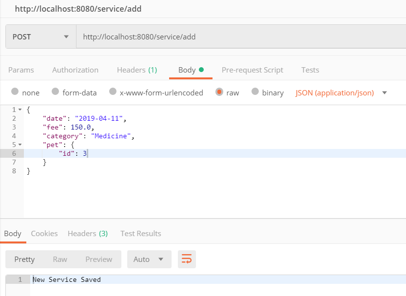

   

8. Get：http://localhost:8080/service/all

   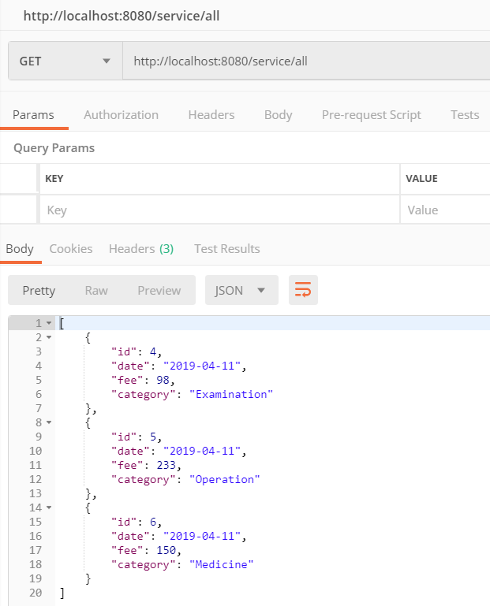

   

9. Get：http://localhost:8080/pets/all

   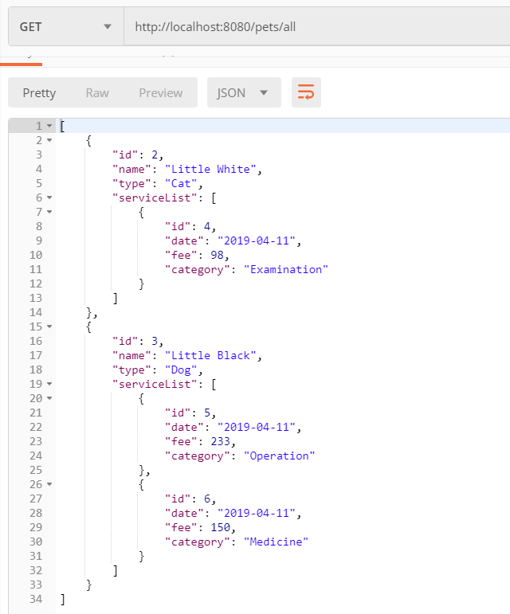

   

10. Get：http://localhost:8080/owners/all

    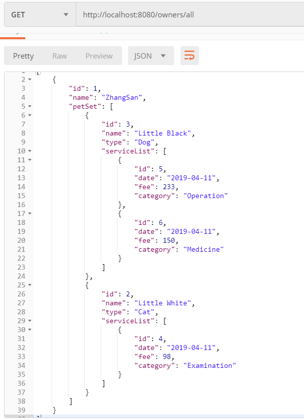

    

11. DataBase：Owner

    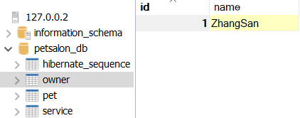

    

12. DataBase：Pet

    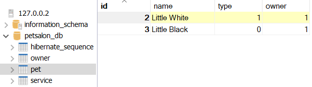

    

13. DataBase：Service

    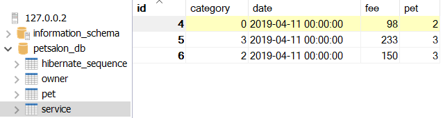

    


# Petsalon v1.0

- 三组 Model - Repository - Controller：

  Owner - OwnerRepository - OwnerController

  Pet - PetRepository - PetController

  Service - ServiceRepository - ServiceController

  

- resources/application.properties：

  ```properties
  spring.jpa.hibernate.ddl-auto=create
  spring.datasource.url=jdbc:mysql://localhost:3306/petsalon_db?serverTimezone=GMT%2B8
  # user: 'aldebarain'@'%' ; password=''
  spring.datasource.username=aldebarain
  spring.datasource.password=
  ```

  

### Model (njuics.demos.petsalon.model)

- Owner

  ```java
  @Entity
  public class Owner {
      @Id
      @GeneratedValue(strategy=GenerationType.AUTO)
      private Integer id;
      private String name;
      ... // getter-setter
  }
  ```

- Pet

  ```java
  @Entity
  public class Pet {
      @Id
      @GeneratedValue(strategy=GenerationType.AUTO)
      private Integer id;
      private String name;
      private PetType type; // 包括：Dog, Cat, Hamster, Bird
      ... // getter-setter
  }
  ```

- Service 

  ```java
  @Entity
  public class Service {
      @Id
      @GeneratedValue(strategy=GenerationType.AUTO)
      private Integer id;
      @JsonFormat(timezone = "GMT+8",pattern = "yyyy-MM-dd")
      @DateTimeFormat(pattern="yyyy-MM-dd")
      private Date date;
      private Double fee;
      private ServiceCategory category; // 包括：Examination, Injection, Medicine, Operation, Nursing, Cosmetology
      ... // getter-setter
  }
  ```

  

### Repository (njuics.demos.petsalon.repository)

- OwnerController (extends CrudRepository<Owner, Integer>)
- PetController (extends CrudRepository<Pet, Integer>)
- ServiceController (extends CrudRepository<Service, Integer>)


### Controller (njuics.demos.petsalon.controller)

- OwnerController

  ```java
  @RestController
  @RequestMapping(path="/owners") // URL start with /owners
  public class OwnerController {
  	@Autowired
  	private OwnerRepository ownerRepository; // 连接 OwnerRepository
  
  	@PostMapping(path="/add") // 添加Owner
  	public @ResponseBody String addNewOwner (@RequestBody Owner owner) {
  		ownerRepository.save(owner);
  		return "New Owner Saved"; // the response (not a view)
  	}
  	
  	@GetMapping(path="/all") // 查看所有Owner
  	public @ResponseBody Iterable<Owner> getAllOwners() {
  		return ownerRepository.findAll();
  	}
  }
  ```

  

- PetController

  ```java
  @Controller 
  @RequestMapping(path="/pets") // URL start with /pets
  public class PetController {
  	@Autowired
  	private PetRepository petRepository; // 连接 PetRepository
  
  	@PostMapping(path="/add") // 添加Pet
  	public @ResponseBody String addNewPet (@RequestBody Pet pet) { ... }
  	
  	@GetMapping(path="/all") // 查看所有Pet
  	public @ResponseBody Iterable<Pet> getAllPets() { ... }
  }
  ```

  

- ServiceController

  ```java
  @RestController
  @RequestMapping(path="/service") // URL start with /service
  public class ServiceController {
  	@Autowired
  	private ServiceRepository serviceRepository; // 连接 ServiceRepository
  
  	@PostMapping(path="/add") // 添加Service
  	public @ResponseBody String addNewService (@RequestBody Service service) { ... }
  	
  	@GetMapping(path="/all") // 查看所有Service
  	public @ResponseBody Iterable<Service> getAllService() { ... }
  }
  ```

  

### 运行（Postman）

以 <http://localhost:8080/pets/> 为例：

- Get：<http://localhost:8080/pets/all> 

  

  可见，当前数据库为空，可查看数据库：

  

  

- Post：http://localhost:8080/pets/add

  

  成功传上了一个名为“Little White”的猫，查看数据库：

  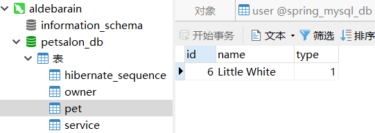

  刷新网页 <http://localhost:8080/pets/all>，可以看到：

  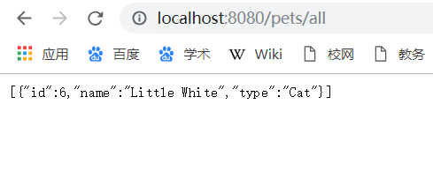

  

- 终止程序，再次查看数据库，数据没有消失，持久化存储成功


