# Petsalon v2.3

- 前端 client

  - 增加 Owner 页面与 Pet 页面的联系：

    - 从 Owners 列表的页面 <http://localhost:8000/owners> 可跳转到任一个 Owner 的详细信息页面：

      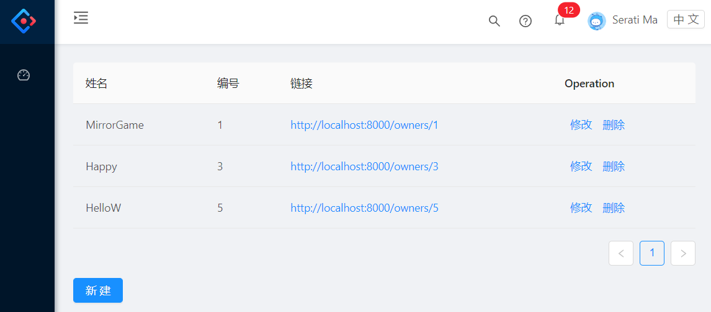

    - Owner 的详细信息页面为 <http://localhost:8000/owners/{id}>，展示了 Owner 个人信息以及该 Owner 拥有的 Pets 列表：

      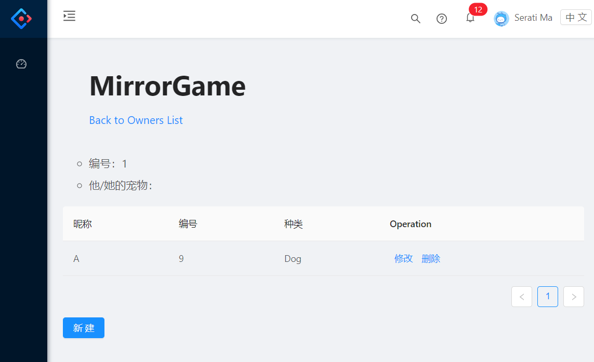

      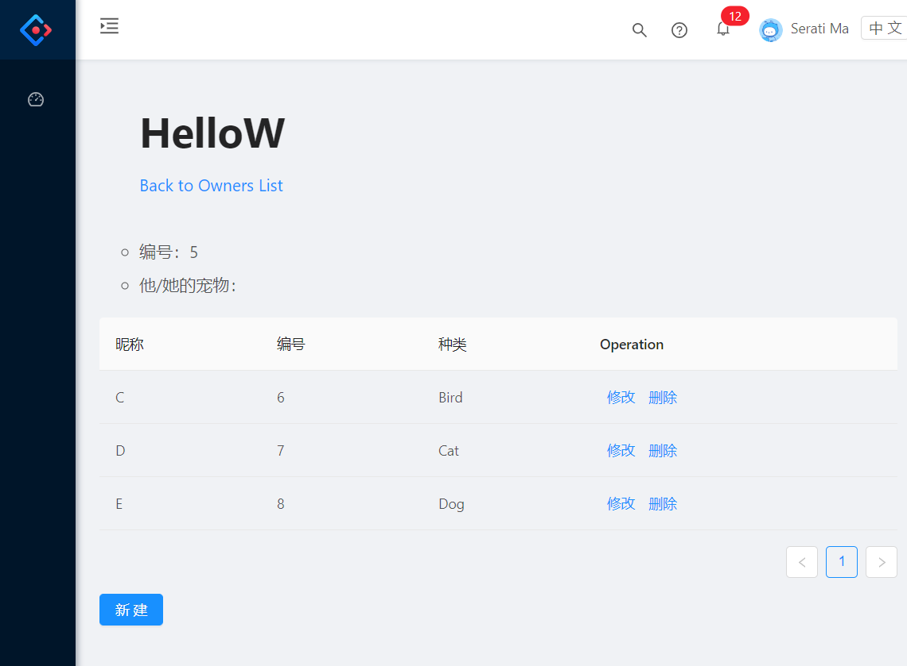

    - Owner 详细信息页面的超链接（Back to Owners List）可回到 Owners 列表

    - Pets 的混合列表（即不论其 Owner 是谁全都混在一起的表）地址依然在 <http://localhost:8000/pets>：

      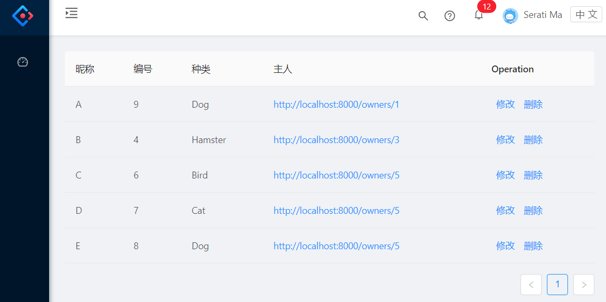

    - 从 Pets 混合列表的“主人”列，可以到达 Pet 对应 Owner 的详细信息页面

    - 取消 Pets 的混合列表页面的新建宠物功能（因为难以与 Owner 绑定），新建宠物功能转移到 Owner 的详细信息页面上

    

- 后端

  - 根据前端页面关系的变动，更改一下 api 地址

  - PetController 类新增方法，供 Owner 获取其拥有的部分宠物列表：

    ```java
    	@GetMapping(path="/owners/{ownerId}/pets")
    	public @ResponseBody // 用于在Owner的详细信息页面上显示宠物列表
    	List<Resource<Pet>> getMyPets(@PathVariable Integer ownerId) {
    		Iterable<Pet> petsIt = petRepository.findAll();
    		List<Pet> petsLs = new ArrayList<>();
    		petsIt.forEach(i -> { 
    			if (i.getOwner().getId() == ownerId) // 筛选：仅获取当前owner对应的pets
    				petsLs.add(i); 
    		});
    		List<Resource<Pet>> pets = petsLs.stream().map(
    				pet -> toResource(pet)
    				).collect(Collectors.toList());
    		return pets;
    	}
    	@PostMapping(path="/owners/{ownerId}/pets")
    	public @ResponseBody // 用于在Owner的详细信息页面上新建宠物
    	Pet addNewPet (@RequestBody Pet pet, @PathVariable Integer ownerId) {
    		// @ResponseBody means the returned String is the response, not a view name
    		// @RequestParam means it is a parameter from the GET or POST request
    		pet.setOwner(ownerRepository.findById(ownerId)
    				.orElseThrow(() -> new RuntimeException()));
    		petRepository.save(pet);
    		return pet;
    	}
    ```

    


# Petsalon v2.2

- 前端 client

  - [Owners](http://localhost:8000/owners) ，[Pets](http://localhost:8000/pets) ，[Service](http://localhost:8000/service) 三个页面均具有功能：
    - 查看全部列表
    - 新建列表项
    - 删除列表项
    - 修改列表项
  - 细节：
    - 新建/修改列表项时，弹出的 Modal 中有些是必填项目
    - 每个列表项在修改时，弹出的 Modal 中的初始值为修改前的原数值
    - 编号（id）不可修改（在新建时自动生成）
    - Pets 的宠物类型以及 Service 的服务类型使用 SELECT（下拉菜单）
    - Service 的 date 项使用 DatePicker，格式转换使用 UTC（"YYYY-MM-DD'T'HH:mm:ss.SSS'Z'"）
    - Service 的 fee 项使用正则表达式来确保输入为 Unsigned Double（pattern: /^(0|[1-9][0-9]*)(\.[0-9]+)?$/）

- 后端

  - 修复了 PUT 过程的 bug

  - 简化 HATEOAS 的相关代码

  - Service 类的日期格式更改为 UTC 以适应前端

    ```java
        @JsonFormat(pattern = "yyyy-MM-dd'T'HH:mm:ss.SSS'Z'") // 后台到前台的时间格式的转换
        @DateTimeFormat(pattern = "yyyy-MM-dd'T'HH:mm:ss.SSS'Z'") // 前台到后台的时间格式的转换
        private Date date;
    ```

  - 调整部分细节


### 页面展示

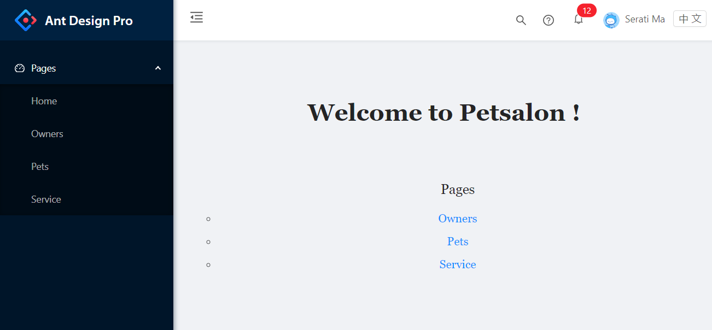

下面以 [Service](http://localhost:8000/service) 为例：

- 创建

  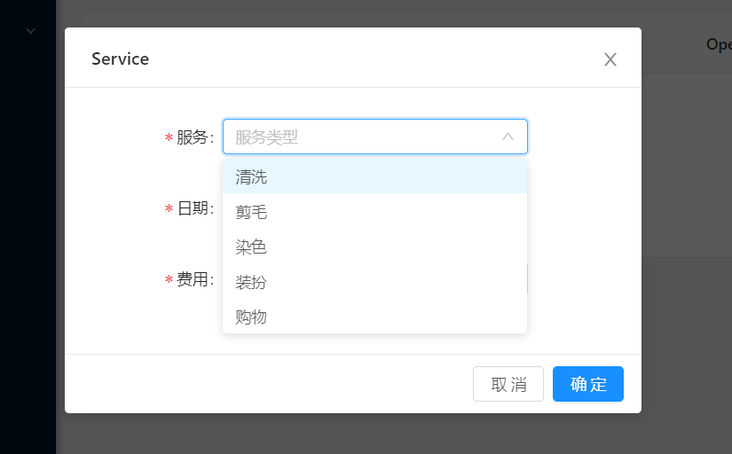

  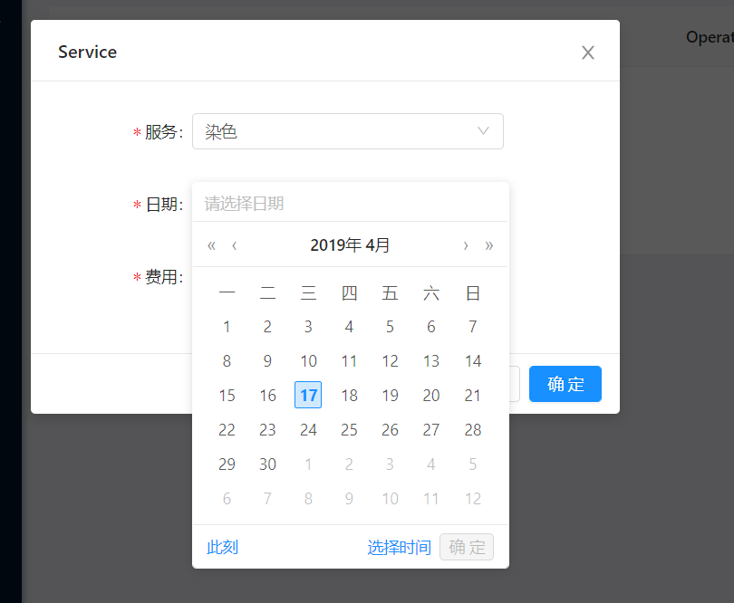

  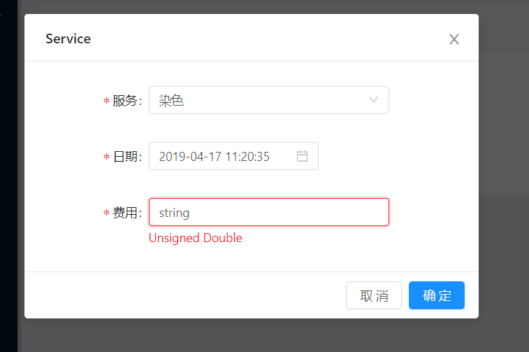

  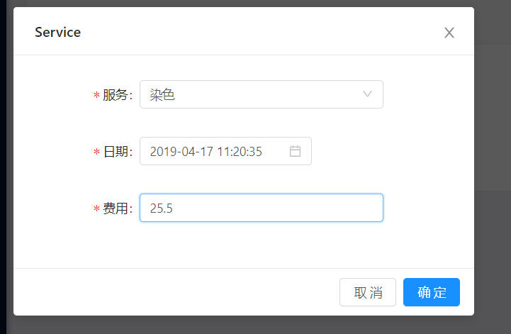

  

- 显示列表

  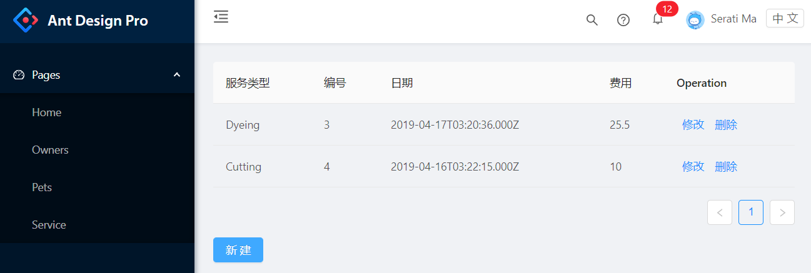

  

- 修改

  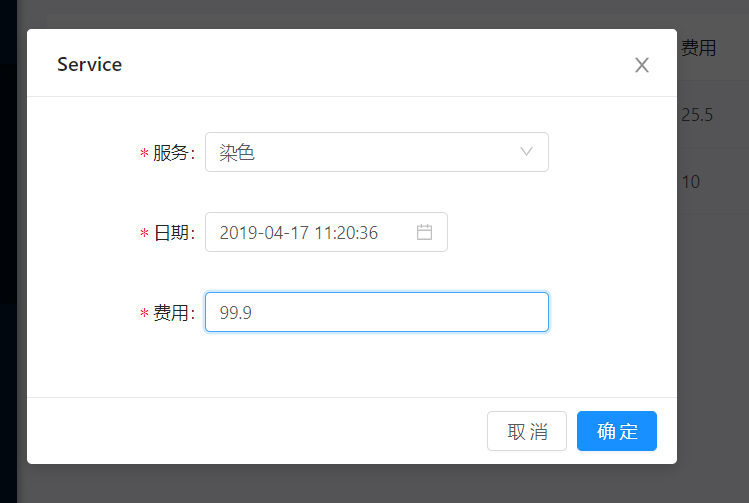

  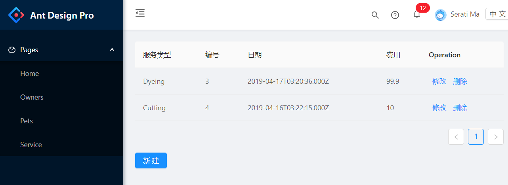

  

- 删除

  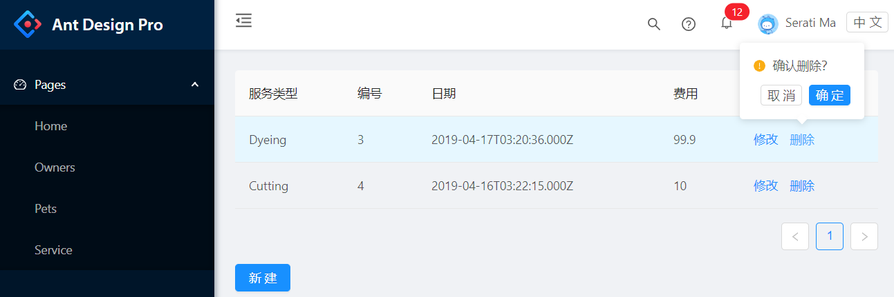

  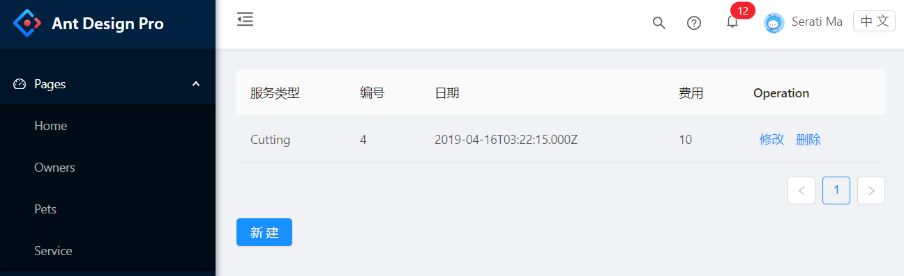


# Petsalon v2.1

- 添加前端页面

  - 在文件夹 client 的路径下打开控制台，运行 `yarn` 和 `yarn start` ，并访问 <http://localhost:8000>

  - 当前可用的只有 [Owners](http://localhost:8000/owners) 部分的：查看全部列表、新建，删除功能

- 发现修改功能（PUT）存在 bug，尚未修改


# Petsalon v1.4

- 添加 Delete 和 Put（删除和刷新功能）


# Petsalon v1.3

- 此前版本均还不够“RESTFUL”（大概在 Richardson 的 REST 成熟度模型的 Level 2 ？），这个版本将开始使用HATEOAS（即 Level 3）
- 突然发现不小心把宠物美容店当成了宠物医院……其实只有 ServiceCategory 的内容有点歪，原理还是一样的，更改 ServiceCategory 之前的运行结果就不改了……


### HATEOAS

- 以 OwnerController 的 @GetMapping 为例

  （PetController 和 ServiceController 的 @GetMapping 同理）

  ```java
  @RestController
  @RequestMapping(path="/owners") 
  public class OwnerController {
      ...
  	@GetMapping(path="")
  	public @ResponseBody 
  	Resources<Resource<Owner>> getAllOwners() {
  		// 先将 ownerRepository.findAll() 从 Iterable<> 转换为 List<>
  		Iterable<Owner> ownersIt = ownerRepository.findAll();
  		List<Owner> ownersLs = new ArrayList<>();
  		ownersIt.forEach(i -> { ownersLs.add(i); });
  		
  		List<Resource<Owner>> owners = ownersLs.stream().map(
  				owner -> new Resource<>(owner, 
  						linkTo(methodOn(OwnerController.class).getOneOwner(owner.getId())).withSelfRel(),
  						linkTo(methodOn(OwnerController.class).getAllOwners()).withRel("owners")
  						)
  				).collect(Collectors.toList());
  		
  		return new Resources<>(owners, linkTo(methodOn(OwnerController.class).getAllOwners()).withSelfRel());
  	}
  	
  	@GetMapping("/{id}")
  	public @ResponseBody 
  	Resource<Owner> getOneOwner(@PathVariable Integer id) {
  		Owner owner = ownerRepository.findById(id)
  				.orElseThrow(() -> new RuntimeException());
  
  		return new Resource<>(owner,
  			linkTo(methodOn(OwnerController.class).getOneOwner(id)).withSelfRel(),
  			linkTo(methodOn(OwnerController.class).getAllOwners()).withRel("owners"));
  	}
  }
  ```

  


# Petsalon v1.2

- 添加 Owner - Pet 的一对多关联（双向）
- 添加 Pet - Service 的一对多关联（双向）

以上两个关联，添加时需要注意：

1. 在 @OneToMany 之下使用 @JoinColumn(name="...") 来指定生成外键的名字，而不能使用 @OneToMany(mappedBy="...")，否则会产生中间表，据我个人猜测，这导致同时具有 @OneToMany 和 @ManyToOne 的类 Pet 的 Table 内部产生分歧（两个中间表），导致无法 Post
2. 在 @ManyToOne 之上使用 @JsonBackReference，避免双向关联导致的输出 Json 文件产生死循环


### 关联代码

- Owner (1*Owner >>> n * Pet)

  ```java
  @Entity
  public class Owner {
      ...
      @OneToMany(targetEntity=Pet.class, cascade=CascadeType.ALL)
  	@JoinColumn(name="owner", referencedColumnName = "id")
      private Set<Pet> petSet; // 宠物集合
      ...
      ... // getter-setter for petSet
  }
  ```

  

- Pet (1*Pet >>> n * Service)

  ```java
  @Entity
  public class Pet {
      ...    
  	@JsonBackReference // 防止双向关联死循环
  	@ManyToOne(targetEntity=Owner.class)
      @JoinColumn(name="owner", referencedColumnName = "id")
      private Owner owner; // 对应主人
  
      @OneToMany(targetEntity=Service.class, cascade=CascadeType.ALL)
  	@JoinColumn(name="pet", referencedColumnName = "id")
      private List<Service> serviceList; // 服务列表
      ...
      ... // getter-setter for serviceList & owner
  }
  ```

  

- Service

  ```java
  @Entity
  public class Service {
      ...
  	@JsonBackReference // 防止双向关联死循环
  	@ManyToOne(targetEntity=Pet.class)
      @JoinColumn(name="pet", referencedColumnName = "id")
      private Pet pet; // 对应宠物
      ...
      ... // getter-setter for pet
  }
  ```


# Petsalon v1.0

- 三组 Model - Repository - Controller：

  Owner - OwnerRepository - OwnerController

  Pet - PetRepository - PetController

  Service - ServiceRepository - ServiceController

  

- resources/application.properties：

  ```properties
  spring.jpa.hibernate.ddl-auto=create
  spring.datasource.url=jdbc:mysql://localhost:3306/petsalon_db?serverTimezone=GMT%2B8
  # user: 'aldebarain'@'%' ; password=''
  spring.datasource.username=aldebarain
  spring.datasource.password=
  ```

  

### Model (njuics.demos.petsalon.model)

- Owner

  ```java
  @Entity
  public class Owner {
      @Id
      @GeneratedValue(strategy=GenerationType.AUTO)
      private Integer id;
      private String name;
      ... // getter-setter
  }
  ```

- Pet

  ```java
  @Entity
  public class Pet {
      @Id
      @GeneratedValue(strategy=GenerationType.AUTO)
      private Integer id;
      private String name;
      private PetType type; // 包括：Dog, Cat, Hamster, Bird
      ... // getter-setter
  }
  ```

- Service 

  ```java
  @Entity
  public class Service {
      @Id
      @GeneratedValue(strategy=GenerationType.AUTO)
      private Integer id;
      @JsonFormat(timezone = "GMT+8",pattern = "yyyy-MM-dd")
      @DateTimeFormat(pattern="yyyy-MM-dd")
      private Date date;
      private Double fee;
      private ServiceCategory category; // 包括：Examination, Injection, Medicine, Operation, Nursing, Cosmetology
      ... // getter-setter
  }
  ```

  

### Repository (njuics.demos.petsalon.repository)

- OwnerController (extends CrudRepository<Owner, Integer>)
- PetController (extends CrudRepository<Pet, Integer>)
- ServiceController (extends CrudRepository<Service, Integer>)


### Controller (njuics.demos.petsalon.controller)

- OwnerController

  ```java
  @RestController
  @RequestMapping(path="/owners") // URL start with /owners
  public class OwnerController {
  	@Autowired
  	private OwnerRepository ownerRepository; // 连接 OwnerRepository
  
  	@PostMapping(path="/add") // 添加Owner
  	public @ResponseBody String addNewOwner (@RequestBody Owner owner) {
  		ownerRepository.save(owner);
  		return "New Owner Saved"; // the response (not a view)
  	}
  	
  	@GetMapping(path="/all") // 查看所有Owner
  	public @ResponseBody Iterable<Owner> getAllOwners() {
  		return ownerRepository.findAll();
  	}
  }
  ```

  

- PetController

  ```java
  @Controller 
  @RequestMapping(path="/pets") // URL start with /pets
  public class PetController {
  	@Autowired
  	private PetRepository petRepository; // 连接 PetRepository
  
  	@PostMapping(path="/add") // 添加Pet
  	public @ResponseBody String addNewPet (@RequestBody Pet pet) { ... }
  	
  	@GetMapping(path="/all") // 查看所有Pet
  	public @ResponseBody Iterable<Pet> getAllPets() { ... }
  }
  ```

  

- ServiceController

  ```java
  @RestController
  @RequestMapping(path="/service") // URL start with /service
  public class ServiceController {
  	@Autowired
  	private ServiceRepository serviceRepository; // 连接 ServiceRepository
  
  	@PostMapping(path="/add") // 添加Service
  	public @ResponseBody String addNewService (@RequestBody Service service) { ... }
  	
  	@GetMapping(path="/all") // 查看所有Service
  	public @ResponseBody Iterable<Service> getAllService() { ... }
  }
  ```

