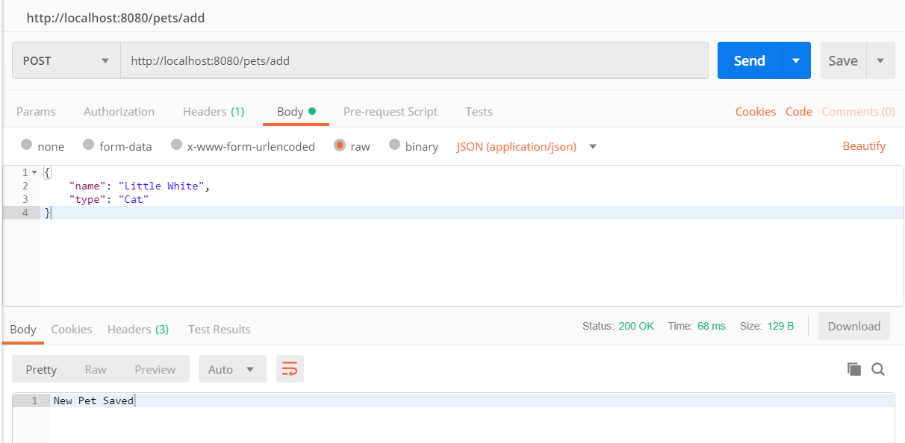

# Petsalon v1.1

- 添加 Owner - Pet 的一对多关联
- 待解决：Pet - Service 的一对多关联（疑似冲突）


# Petsalon v1.0

- 三组 Model - Repository - Controller：

  Owner - OwnerRepository - OwnerController

  Pet - PetRepository - PetController

  Service - ServiceRepository - ServiceController

  

- resources/application.properties：

  ```properties
  spring.jpa.hibernate.ddl-auto=create
  spring.datasource.url=jdbc:mysql://localhost:3306/petsalon_db?serverTimezone=GMT%2B8
  # user: 'aldebarain'@'%' ; password=''
  spring.datasource.username=aldebarain
  spring.datasource.password=
  ```

  

### Model (njuics.demos.petsalon.model)

- Owner

  ```java
  @Entity
  public class Owner {
      @Id
      @GeneratedValue(strategy=GenerationType.AUTO)
      private Long id;
      private String name;
      ... // getter-setter
  }
  ```

- Pet

  ```java
  @Entity
  public class Pet {
      @Id
      @GeneratedValue(strategy=GenerationType.AUTO)
      private Integer id;
      private String name;
      private PetType type; // 包括：Dog, Cat, Hamster, Bird
      ... // getter-setter
  }
  ```

- Service 

  ```java
  @Entity
  public class Service {
      @Id
      @GeneratedValue(strategy=GenerationType.AUTO)
      private Long id;
      private Date date;
      private Double fee;
      private ServiceCategory category; // 包括：Examination, Injection, Medicine, Operation, Nursing, Cosmetology
      ... // getter-setter
  }
  ```

  

### Repository (njuics.demos.petsalon.repository)

- OwnerController (extends CrudRepository<Owner, Long>)
- PetController (extends CrudRepository<Pet, Long>)
- ServiceController (extends CrudRepository<Service, Long>)


### Controller (njuics.demos.petsalon.controller)

- OwnerController

  ```java
  @RestController
  @RequestMapping(path="/owners") // URL start with /owners
  public class OwnerController {
  	@Autowired
  	private OwnerRepository ownerRepository; // 连接 OwnerRepository
  
  	@PostMapping(path="/add") // 添加Owner
  	public @ResponseBody String addNewOwner (@RequestBody Owner owner) {
  		ownerRepository.save(owner);
  		return "New Owner Saved"; // the response (not a view)
  	}
  	
  	@GetMapping(path="/all") // 查看所有Owner
  	public @ResponseBody Iterable<Owner> getAllOwners() {
  		return ownerRepository.findAll();
  	}
  }
  ```

  

- PetController

  ```java
  @Controller 
  @RequestMapping(path="/pets") // URL start with /pets
  public class PetController {
  	@Autowired
  	private PetRepository petRepository; // 连接 PetRepository
  
  	@PostMapping(path="/add") // 添加Pet
  	public @ResponseBody String addNewPet (@RequestBody Pet pet) { ... }
  	
  	@GetMapping(path="/all") // 查看所有Pet
  	public @ResponseBody Iterable<Pet> getAllPets() { ... }
  }
  ```

  

- ServiceController

  ```java
  @RestController
  @RequestMapping(path="/service") // URL start with /service
  public class ServiceController {
  	@Autowired
  	private ServiceRepository serviceRepository; // 连接 ServiceRepository
  
  	@PostMapping(path="/add") // 添加Service
  	public @ResponseBody String addNewService (@RequestBody Service service) { ... }
  	
  	@GetMapping(path="/all") // 查看所有Service
  	public @ResponseBody Iterable<Service> getAllService() { ... }
  }
  ```

  

### 运行（Postman）

以 <http://localhost:8080/pets/> 为例：

- Get：<http://localhost:8080/pets/all> 

  

  可见，当前数据库为空，可查看数据库：

  

  

- Post：http://localhost:8080/pets/add

  

  成功传上了一个名为“Little White”的猫，查看数据库：

  

  刷新网页 <http://localhost:8080/pets/all>，可以看到：

  

  

- 终止程序，再次查看数据库，数据没有消失，持久化存储成功


